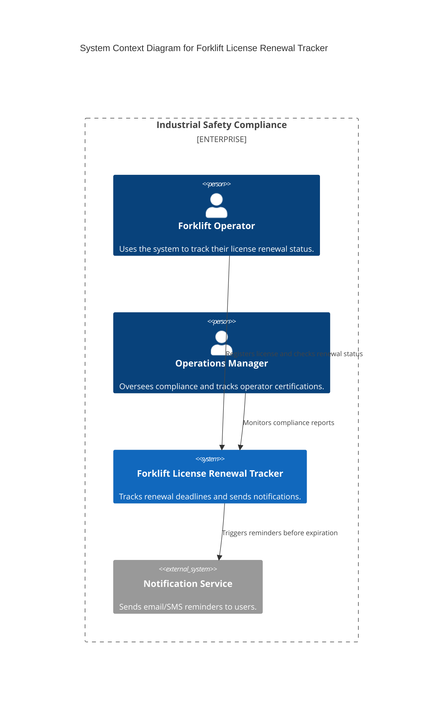
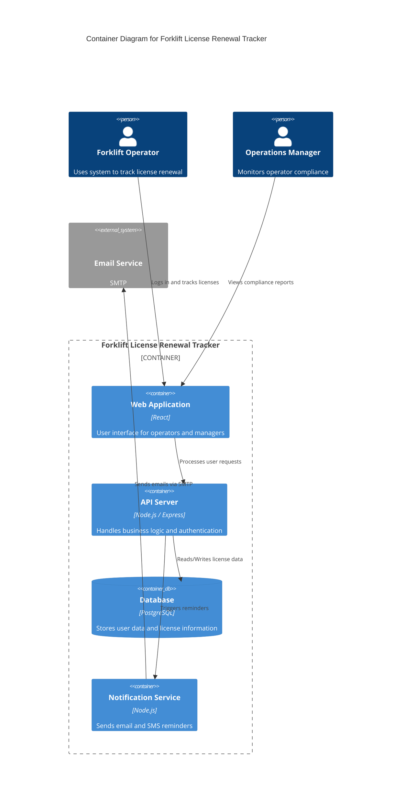
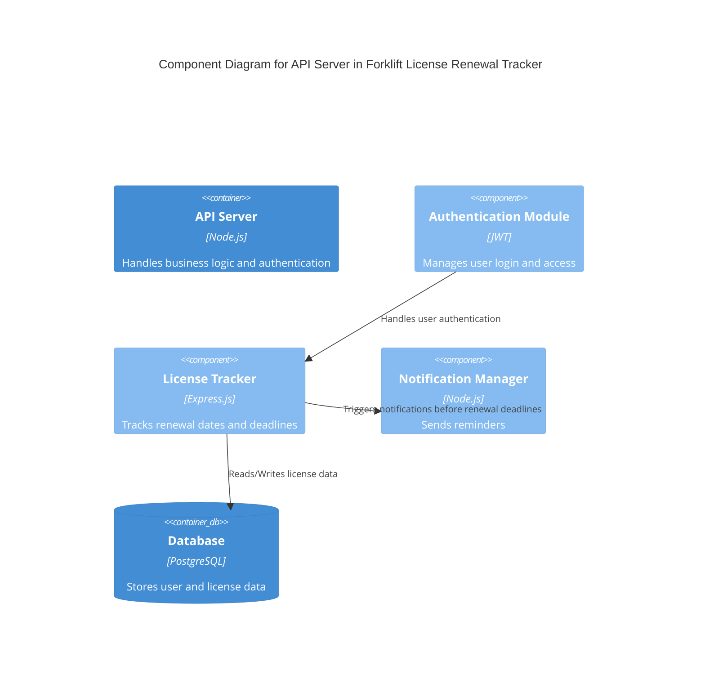
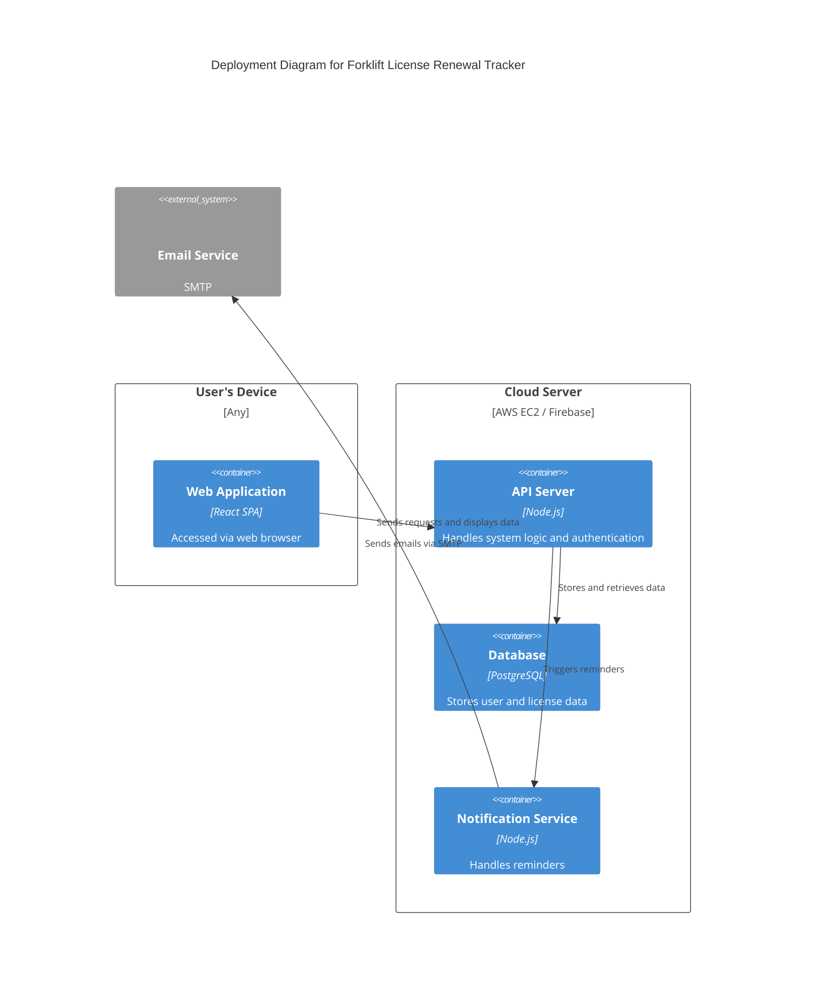

# Architecture Overview

## 📄 File: Architecture.md

## 📌 Description  
This document outlines the **architectural structure** of the **Forklift License Renewal Tracker**. It follows the **C4 Model**, breaking the system into **Context, Container, Component, and Deployment** levels.

---

### 📊 What Will Be Covered
## 🌍 **Context Diagram** – Shows how the system interacts with users and external services.

**📦 Container Diagram** – Illustrates the major containers (applications or services) that make up the system and how they interact.

**🧩 Component Diagram** – Details the internal structure of the API server, showing the key components and their interactions.

**🖥️ Deployment Diagram** – Shows how the system is deployed across different environments and devices.

Each of these diagrams provides a different perspective, ensuring that developers, architects, and stakeholders can understand the system’s **design, interactions, and dependencies** at various levels. 
