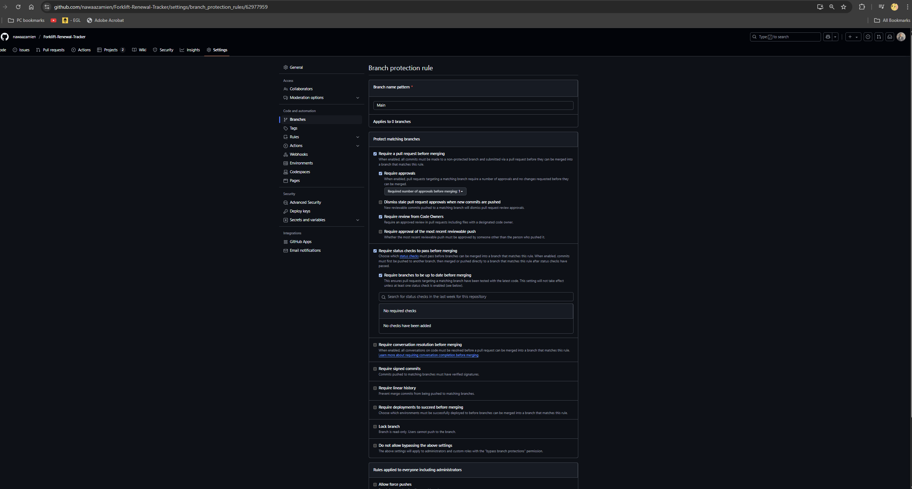

# Branch Protection Rules

## Why Branch Protection Rules Matter

Branch protection rules are essential for maintaining the integrity and stability of the main branch in a collaborative software development environment. These rules enforce best practices and ensure that changes are reviewed, tested, and approved before being merged into the main branch.

### Key Rules and Their Importance

1. **Require Pull Request Reviews**
   - **What it does**: Ensures that at least one team member reviews and approves changes before they are merged into the main branch.
   - **Why it matters**: This rule helps catch potential bugs, ensures code quality, and promotes collaboration by involving multiple team members in the review process.

2. **Require Status Checks to Pass**
   - **What it does**: Ensures that all automated tests and CI workflows (e.g., linting, unit tests, integration tests) pass before changes can be merged.
   - **Why it matters**: This rule prevents broken code from being merged into the main branch, ensuring that the codebase remains stable and functional.

3. **Disable Direct Pushes**
   - **What it does**: Prevents developers from pushing changes directly to the main branch. All changes must go through a pull request (PR).
   - **Why it matters**: This rule enforces a structured workflow where changes are reviewed and tested before being integrated, reducing the risk of accidental or unreviewed changes.

### Benefits of Branch Protection Rules
- **Code Quality**: Ensures that all changes meet the project's quality standards.
- **Collaboration**: Encourages team members to work together and review each other's work.
- **Stability**: Prevents unstable or untested code from being merged into the main branch.
- **Accountability**: Tracks who made changes and ensures that all changes are approved.

### Screenshot of Branch Protection Rules
Below is a screenshot of the branch protection rules configured for the `main` branch:

