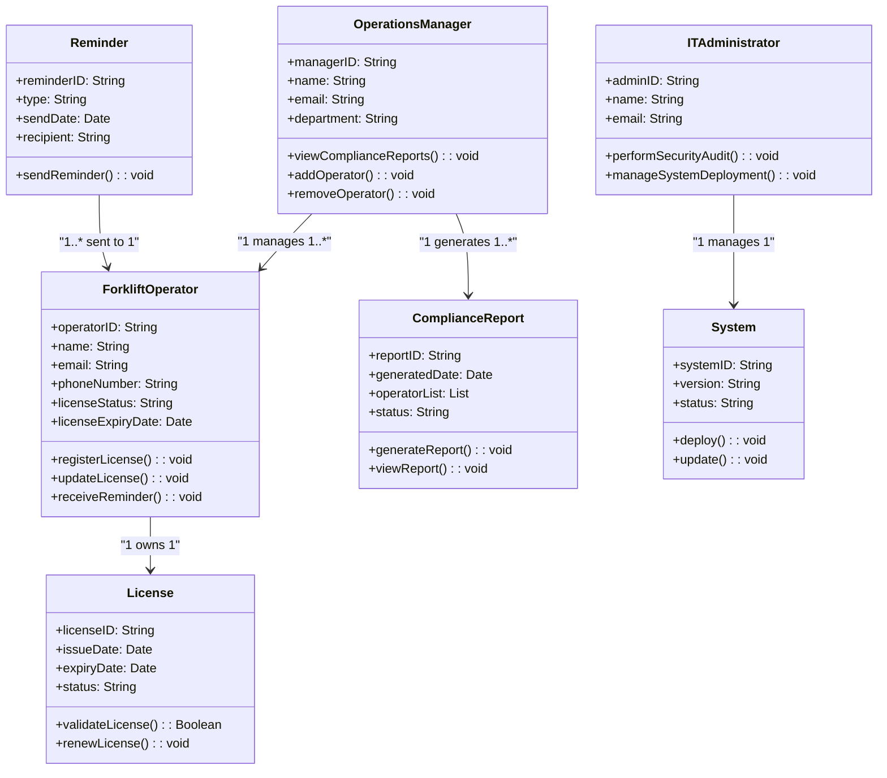

# 🛠️ Domain Model

## 📋 Entities, Attributes, Methods, and Relationships

| **Entity**          | **Attributes**                                                                 | **Methods**                                | **Relationships**                                   |
|----------------------|-------------------------------------------------------------------------------|-------------------------------------------|---------------------------------------------------|
| **ForkliftOperator** | `operatorID`, `name`, `email`, `phoneNumber`, `licenseStatus`, `licenseExpiryDate` | `registerLicense()`, `updateLicense()`, `receiveReminder()` | Has a **License**                                  |
| **License**          | `licenseID`, `issueDate`, `expiryDate`, `status`                              | `validateLicense()`, `renewLicense()`      | Belongs to a **ForkliftOperator**                 |
| **OperationsManager**| `managerID`, `name`, `email`, `department`                                    | `viewComplianceReports()`, `addOperator()`, `removeOperator()` | Manages multiple **ForkliftOperators** and generates **ComplianceReports** |
| **ComplianceReport** | `reportID`, `generatedDate`, `operatorList`, `status`                         | `generateReport()`, `viewReport()`         | Generated by an **OperationsManager**            |
| **Reminder**         | `reminderID`, `type` (email/SMS), `sendDate`, `recipient`                     | `sendReminder()`                           | Sent to a **ForkliftOperator**                    |
| **ITAdministrator**  | `adminID`, `name`, `email`                                                    | `performSecurityAudit()`, `manageSystemDeployment()` | Manages the **System**                            |
| **System**           | `systemID`, `version`, `status`                                               | `deploy()`, `update()`                     | Managed by an **ITAdministrator**                |

---

## 📜 Business Rules

1. A **ForkliftOperator** must have a valid **License** to operate.  
2. A **License** must be renewed before its expiry date.  
3. A **Reminder** is sent 30 days and 7 days before the **License** expiry date.  
4. An **OperationsManager** can add or remove **ForkliftOperators**.  
5. A **ComplianceReport** must include all operators and their license statuses.  
6. An **ITAdministrator** is responsible for ensuring the **System** is secure and up-to-date.

# 📊 Class Diagram

## 📝 Explanation of Key Design Decisions

1. **Classes and Attributes**:
   - Each class represents a key entity in the system, such as `ForkliftOperator`, `License`, and `ComplianceReport`.
   - Attributes were chosen to reflect the essential data each entity needs to function (e.g., `licenseExpiryDate` for `License`).

2. **Methods**:
   - Methods were added to represent the responsibilities of each class. For example:
     - `registerLicense()` and `updateLicense()` for `ForkliftOperator`.
     - `generateReport()` for `ComplianceReport`.

3. **Relationships**:
   - **Association**: A `ForkliftOperator` owns a `License` (1-to-1 relationship).
   - **Aggregation**: An `OperationsManager` manages multiple `ForkliftOperators` (1-to-many relationship).
   - **Composition**: An `OperationsManager` generates multiple `ComplianceReports` (1-to-many relationship).
   - **Multiplicity**: Relationships include multiplicity indicators (e.g., `1..*` for multiple operators managed by an `OperationsManager`).

4. **Notes**:
   - The `Reminder` class is associated with `ForkliftOperator` to represent notifications sent to operators.
   - The `ITAdministrator` class manages the `System` to ensure security and updates.

This class diagram provides a clear and structured view of the system’s design, showing how entities interact and fulfill their responsibilities.