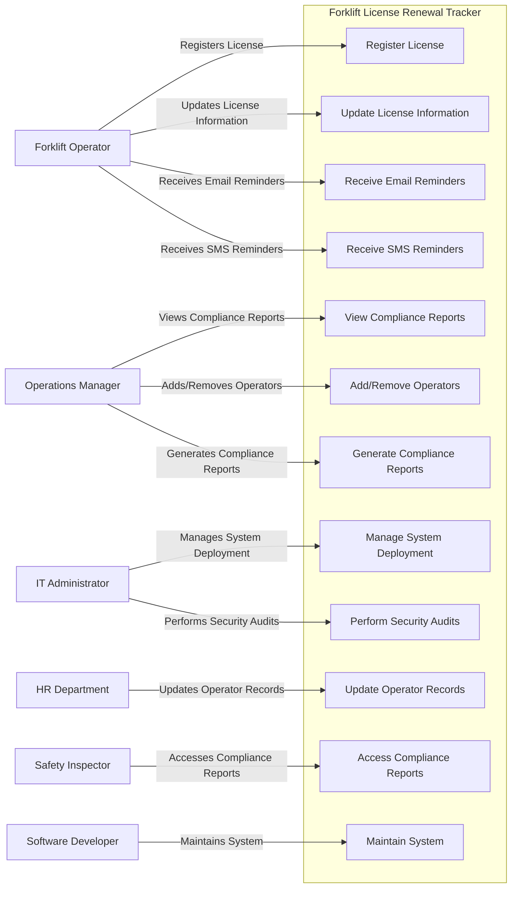

# TEST AND USE CASE DOCUMENT

 
 

# 📌 1. USE CASE DIAGRAM
 
 

    
    
   

# 📌 Key Actors and Their Roles

## 👷 Forklift Operator
**Role:** The primary users who register and update their license information and receive reminders.
**Use Cases:** Register License, Update License Information, Receive Email Reminders, Receive SMS Reminders.

## 👩‍💼 Operations Manager
**Role:** Oversee compliance, manage operator records, and generate compliance reports.
**Use Cases:** View Compliance Reports, Add/Remove Operators, Generate Compliance Reports.

## 🛠️ IT Administrator
**Role:** Manage system deployment and perform security audits.
**Use Cases:** Manage System Deployment, Perform Security Audits.

## 🧑‍💼 HR Department
**Role:** Update operator records.
**Use Cases:** Update Operator Records.

## 🛡️ Safety Inspector
**Role:** Access compliance reports to ensure safety regulations are met.
**Use Cases:** Access Compliance Reports.

## 👨‍💻 Software Developer
**Role:** Maintain the system to ensure it remains functional and secure.
**Use Cases:** Maintain System.

## Generalization and Inclusion

- **Forklift Operators** interact with the system to register and update their license information and receive reminders. These use cases are essential for ensuring that operators maintain valid licenses.
- **Operations Managers** have a broader role that includes viewing compliance reports, managing operator records, and generating compliance reports. These use cases ensure that the operations manager can effectively oversee and manage compliance within the organization.
- **IT Administrators** are responsible for the technical aspects of the system, including deployment and security audits. These use cases ensure the system is reliable and secure.
- **HR Department** focuses on updating operator records, ensuring that all information is current and accurate.
- **Safety Inspectors** access compliance reports to verify that safety regulations are being followed.
- **Software Developers** maintain the system, ensuring it remains functional and secure.

## How the Diagram Addresses Stakeholder Concerns

- **Forklift Operators**: The use cases for registering and updating license information, as well as receiving reminders, address their need for ease of use and timely notifications.
- **Operations Managers**: The ability to view compliance reports and manage operator records ensures they can monitor compliance effectively.
- **IT Administrators**: Managing system deployment and performing security audits address their concerns for system reliability and security.
- **HR Department**: Updating operator records ensures accurate and up-to-date information.
- **Safety Inspectors**: Accessing compliance reports ensures they have the necessary data for audits.
- **Software Developers**: Maintaining the system ensures it remains functional and secure.

---
 
 
 

# 📌 2. Use Case Specifications

## **Use Case 1: Register License**
**🎭 Actor:** Forklift Operator  
**✅ Precondition:** Operator is logged in.  
**📌 Postcondition:** License information is stored in the system.  

### **🔄 Basic Flow:**
1. The operator navigates to the license registration page.
2. The operator enters license details.
3. The system validates the information.
4. The system stores the license information.
5. The system confirms successful registration.

### **Alternative Flows:**
- **Invalid Information:** If the information is invalid, the system displays an error message.

---

## **Use Case 2: Update License Information**
**🎭 Actor:** Forklift Operator  
**✅ Precondition:** Operator is logged in and has a registered license.  
**📌 Postcondition:** Updated license information is stored in the system.  

### **🔄 Basic Flow:**
1. The operator navigates to the update license page.
2. The operator updates license details.
3. The system validates the information.
4. The system updates the license information.
5. The system confirms successful update.

### **Alternative Flows:**
- **Invalid Information:** If the information is invalid, the system displays an error message.

---

## **Use Case 3: Receive Email Reminders**
**🎭 Actor:** Forklift Operator  
**✅ Precondition:** Operator has a registered license with an expiration date.  
**📌 Postcondition:** Operator receives email reminders.  

### **🔄 Basic Flow:**
1. The system checks for upcoming license expirations.
2. The system sends email reminders 30 days and 7 days before expiration.
3. The operator receives email reminders.

### **Alternative Flows:**
- **Email Delivery Failure:** If the email fails to deliver, the system logs the error.

---

## **Use Case 4: Receive SMS Reminders**
**🎭 Actor:** Forklift Operator  
**✅ Precondition:** Operator has a registered license with an expiration date.  
**📌 Postcondition:** Operator receives SMS reminders.  

### **🔄 Basic Flow:**
1. The system checks for upcoming license expirations.
2. The system sends SMS reminders 30 days and 7 days before expiration.
3. The operator receives SMS reminders.

### **Alternative Flows:**
- **SMS Delivery Failure:** If the SMS fails to deliver, the system logs the error.

---

## **Use Case 5: View Compliance Reports**
**🎭 Actor:** Operations Manager  
**✅ Precondition:** Manager is logged in.  
**📌 Postcondition:** Manager views compliance reports.  

### **🔄 Basic Flow:**
1. The manager navigates to the compliance reports page.
2. The manager selects the desired report.
3. The system retrieves and displays the report.

### **Alternative Flows:**
- **Report Not Found:** If the report is not found, the system displays an error message.

---

## **Use Case 6: Add/Remove Operators**
**🎭 Actor:** Operations Manager  
**✅ Precondition:** Manager is logged in.  
**📌 Postcondition:** Operator records are updated.  

### **🔄 Basic Flow:**
1. The manager navigates to the operator management page.
2. The manager selects to add or remove an operator.
3. The manager enters the necessary details.
4. The system validates the information.
5. The system updates the operator records.
6. The system confirms successful update.

### **Alternative Flows:**
- **Invalid Information:** If the information is invalid, the system displays an error message.

---

## **Use Case 7: Generate Compliance Reports**
**🎭 Actor:** Operations Manager  
**✅ Precondition:** Manager is logged in.  
**📌 Postcondition:** Compliance report is generated.  

### **🔄 Basic Flow:**
1. The manager navigates to the compliance reports page.
2. The manager selects the criteria for the report.
3. The system generates the report based on the criteria.
4. The system displays the generated report.

### **Alternative Flows:**
- **Report Generation Failure:** If the report generation fails, the system displays an error message.

---

## **Use Case 8: Perform Security Audits**
**🎭 Actor:** IT Administrator  
**✅ Precondition:** Administrator is logged in.  
**📌 Postcondition:** Security audit is performed.  

### **🔄 Basic Flow:**
1. The administrator navigates to the security audit page.
2. The administrator selects the desired audit.
3. The system performs the audit.
4. The system displays the audit results.

### **Alternative Flows:**
- **Audit Failure:** If the audit fails, the system displays an error message.

---
 
 
 

# 📌 3. Test Case Development

## Functional Test Cases Table

Below is a test case table with **8 test cases** that validate **functional requirements** of the Forklift License Renewal Tracker.

| **Test Case ID** | **Requirement ID** | **Description** | **Steps** | **Expected Result** | **Actual Result** | **Status (Pass/Fail)** |
|-----------------|-----------------|----------------|----------|-----------------|-----------------|------------------|
| **TC-001** | **FR1** | Register License | 1. Navigate to **"Register License"**   2. Enter **license details**   3. Click **"Submit"** | License information is **stored** and **confirmation** is displayed | | |
| **TC-002** | **FR2** | Update License Information | 1. Navigate to **"Update License"**   2. Enter **updated details**   3. Click **"Submit"** | License information is **updated** and **confirmation** is displayed | | |
| **TC-003** | **FR3** | Receive Email Reminders | 1. Set **license expiration date**   2. Wait for **reminder dates** | Email reminders are received **30 days and 7 days** before expiration | | |
| **TC-004** | **FR4** | Receive SMS Reminders | 1. Set **license expiration date**   2. Wait for **reminder dates** | SMS reminders are received **30 days and 7 days** before expiration | | |
| **TC-005** | **FR5** | View Compliance Reports | 1. Navigate to **"Compliance Reports"**   2. Select **report** | Compliance report is **displayed** | | |
| **TC-006** | **FR6** | Add/Remove Operators | 1. Navigate to **"Operator Management"**   2. Add or remove **operator**   3. Enter **details**   4. Click **"Submit"** | Operator records are **updated** and **confirmation** is displayed | | |
| **TC-007** | **FR7** | Generate Compliance Reports | 1. Navigate to **"Compliance Reports"**   2. Select **criteria**   3. Click **"Generate"** | Compliance report is **generated** and **displayed** | | |
| **TC-008** | **FR8** | Perform Security Audits | 1. Navigate to **"Security Audit"**   2. Select **audit**   3. Click **"Perform"** | Security audit is **performed** and **results** are displayed | | |

---

## Non-Functional Test Scenarios

### **⚡ Performance Test:**
✅ Simulate **1,000 concurrent users accessing the system** and verify that the response time remains **≤ 2 seconds** for common operations like viewing compliance reports.

### **🔐 Security Test:**
✅ Attempt a **brute-force attack** on user authentication by entering **multiple incorrect passwords**. Verify that the system **locks the account after five failed attempts** and requires **admin intervention** to reset.

---
 
 
 

# 🎯 Reflection: Challenges in Translating Requirements to Use Cases and Tests

Creating the Forklift License Renewal Tracker involved transforming high-level requirements into detailed use cases and test cases. This process was essential for ensuring system functionality and a smooth user experience but presented several challenges. 
  
One major challenge was defining clear and precise use cases while covering all necessary features. The system serves multiple stakeholders, including forklift operators, operations managers, IT administrators, HR personnel, safety inspectors, and software developers. Each interacts with the system differently, requiring distinct use cases. Overlapping responsibilities, such as compliance report management by both Operations Managers and Safety Inspectors, made it difficult to clearly distinguish their roles. To maintain clarity, I carefully defined each role’s scope, preventing redundancy while ensuring comprehensive documentation.   
Another challenge was handling dependencies between use cases. Many functions relied on others, making it difficult to define a clear execution flow. For instance, updating license information requires a registered license, and generating compliance reports depends on existing operator records. Without proper tracking, critical interactions could be overlooked, leading to gaps in functionality or incomplete test cases. Thoroughly documenting these dependencies was necessary to ensure every feature worked as expected. 
  
Balancing functional and non-functional requirements was also complex. Initially, testing efforts focused on core functions like registering licenses, updating records, and generating reports. However, non-functional aspects, such as performance, security, and usability, proved equally important. For example, performance testing involved simulating 1,000 concurrent users while maintaining response times of ≤2 seconds. Security testing included scenarios like brute-force attack prevention, ensuring user accounts lock after multiple failed login attempts. Unlike functional test cases, these requirements were harder to define using traditional formats, requiring additional test planning.
  
Identifying edge cases and user errors was another key challenge. While standard use cases were straightforward, unexpected user behaviours required careful consideration. Critical questions emerged: What happens if a user enters invalid license details? What if an operator is removed after their records have been updated? How does the system handle internet disruptions during updates? Anticipating these scenarios helped ensure the application remained robust under real-world conditions.
  
Despite these challenges, translating requirements into use cases and test cases was a valuable learning experience. It required critical thinking about system interactions and validation processes. Iteration and refinement were essential to address dependencies, edge cases, and non-functional requirements. Though reworking some aspects was frustrating, I now recognize the importance of precision in creating a well-structured and user-friendly system.
  
Moving forward, leveraging automated test frameworks and improving documentation methodologies will streamline this process. This experience deepened my understanding of software testing and system design, reinforcing the significance of thorough planning and documentation in software development.